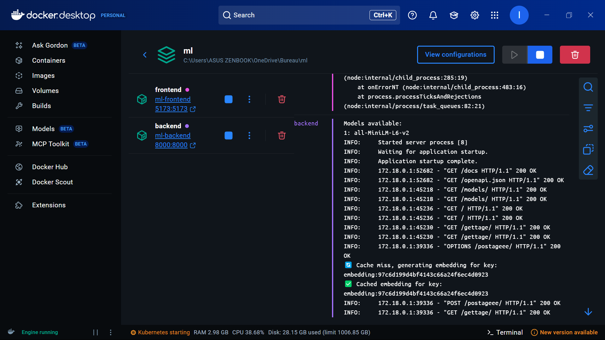
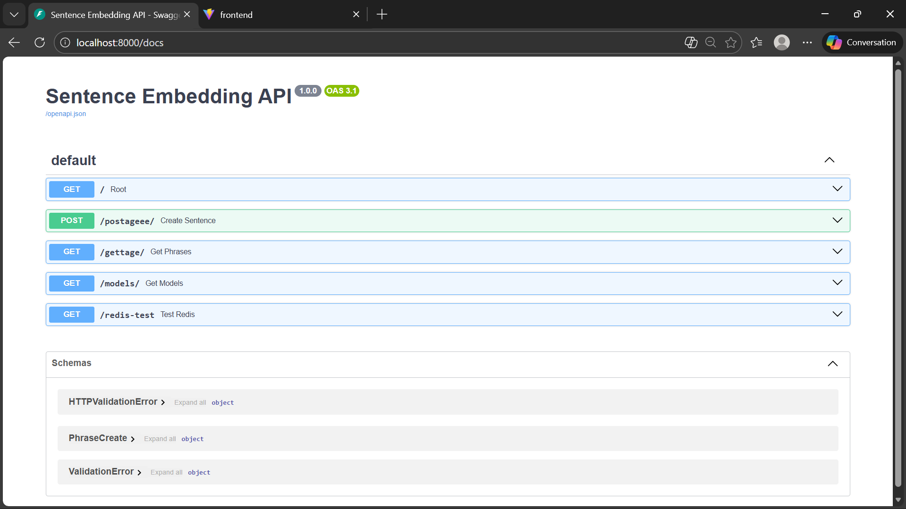
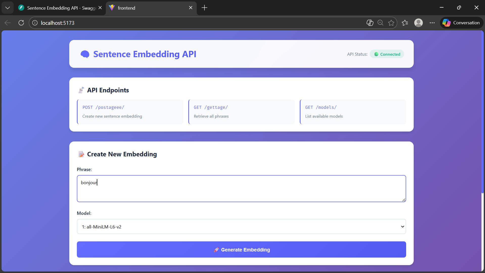
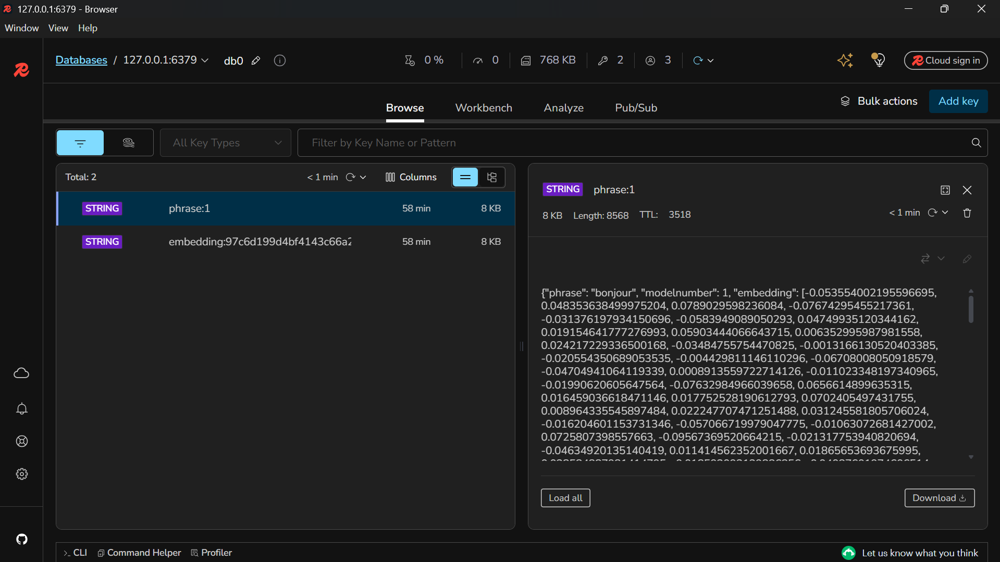
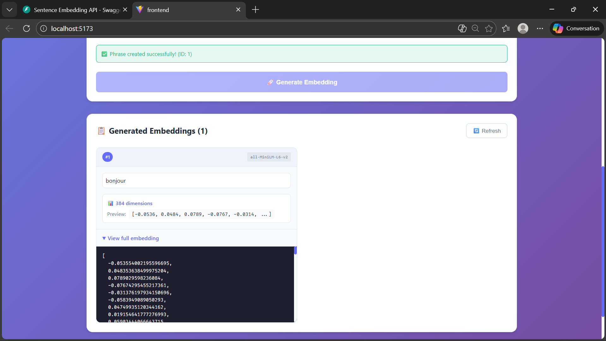

# 🧠 Sentence Embedding API Une application complète de génération d'embeddings de phrases utilisant des modèles **Sentence Transformers**, avec une API **FastAPI**, un cache **Redis** et une interface **React** moderne.

---

## 📋 Table des matières

- [Aperçu du projet](#-aperçu-du-projet)
- [Architecture](#️-architecture)
- [Fonctionnalités](#-fonctionnalités)
- [Prérequis](#-prérequis)
- [Installation et démarrage](#-installation-et-démarrage)
- [Utilisation de l'API](#-utilisation-de-lapi)
- [Interface Frontend](#-interface-frontend)
- [Cache Redis](#-cache-redis)
- [Structure du projet](#-structure-du-projet)
- [Déploiement avec Docker](#-déploiement-avec-docker)
- [Exécution du projet](#️-exécution-du-projet)
- [Dépannage](#-dépannage)
- [Tutoriel vidéo](#-tutoriel-vidéo)

---

## 🎯 Aperçu du projet

Cette application permet de :
- Générer des embeddings (vecteurs) à partir de phrases en langage naturel
- Utiliser plusieurs modèles Sentence Transformers interchangeables
- Mettre en cache les résultats avec Redis pour des performances optimales
- Visualiser les embeddings générés via une interface React intuitive
- Interagir avec le backend via une API RESTful documentée

---

## 🏗️ Architecture

```
ml/
├── backend/                  # API FastAPI
│   ├── app/
│   │   ├── config.py         # Configuration globale
│   │   ├── database.py       # Gestion Redis
│   │   ├── ml_service.py     # Service d'embeddings
│   │   ├── models.py         # Schémas Pydantic
│   │   └── __init__.py
│   ├── models/
│   │   └── all-MiniLM-L6-v2/ # Modèle Sentence Transformer
│   └── Dockerfile
├── frontend/                 # Interface React
│   ├── src/
│   │   ├── App.jsx           # Composant principal
│   │   └── App.css
│   └── Dockerfile
└── docker-compose.yml        # Orchestration des services
```

---

## ✨ Fonctionnalités

| Fonctionnalité | Description |
|---|---|
| 🔄 **Multi-modèles** | Support de plusieurs modèles Sentence Transformers |
| ⚡ **Cache Redis** | Mise en cache des embeddings pour des réponses instantanées |
| 📊 **Interface intuitive** | Frontend React pour visualiser et explorer les résultats |
| 🔌 **API RESTful** | Endpoints clairs avec documentation interactive Swagger |
| 🐳 **Docker** | Conteneurisation complète pour un déploiement reproductible |
| 📈 **Scalable** | Architecture modulaire et facilement extensible |

---

## 📦 Prérequis

- [Docker](https://www.docker.com/) et Docker Compose *(requis)*
- Node.js *(optionnel, pour développement local sans Docker)*
- Python 3.11+ *(optionnel, pour développement local sans Docker)*
- Redis *(optionnel, géré automatiquement via Docker)*

---

## 🚀 Installation et démarrage

### Avec Docker *(recommandé)*

**1. Cloner le dépôt**
```bash
git clone https://github.com/ismailjirari/ml_project_redis_docker.git
cd ml_project_redis_docker
```

**2. Préparer le modèle** *(si non présent)*
```bash
mkdir -p backend/models
# Téléchargez et placez votre modèle Sentence Transformer dans ce dossier
```

**3. Lancer l'application**
```bash
docker-compose up --build
```

**4. Accéder aux services**

| Service | URL |
|---|---|
| 🖥️ Frontend | http://localhost:5173 |
| 🔌 API Backend | http://localhost:8000 |
| 📄 Documentation API | http://localhost:8000/docs |

---

### Sans Docker *(développement local)*

**Backend**
```bash
cd backend
python -m venv venv
source venv/bin/activate  # Windows : venv\Scripts\activate
pip install -r requirements.txt
python main.py
```

**Frontend**
```bash
cd frontend
npm install
npm run dev
```

---

## 📡 Utilisation de l'API

### Endpoints disponibles

| Méthode | Endpoint | Description |
|---|---|---|
| `GET` | `/` | Informations générales de l'API |
| `POST` | `/postageee/` | Créer un embedding |
| `GET` | `/gettage/` | Lister tous les embeddings |
| `GET` | `/models/` | Lister les modèles disponibles |
| `GET` | `/redis-test` | Tester la connexion Redis |

### Exemples d'utilisation

```bash
# Créer un embedding
curl -X POST "http://localhost:8000/postageee/" \
  -H "Content-Type: application/json" \
  -d '{"phrase": "Hello world", "modelnumber": 1}'

# Récupérer tous les embeddings
curl "http://localhost:8000/gettage/"
```

---

## 💻 Interface Frontend

L'interface React propose :
- 📝 **Formulaire de création** — Saisissez une phrase et sélectionnez un modèle
- 📋 **Liste des embeddings** — Visualisez l'ensemble des embeddings générés
- 🔍 **Détails des vecteurs** — Aperçu et exploration complète des embeddings
- 🔄 **Rafraîchissement** — Mise à jour en temps réel de la liste
- 📊 **Statut API** — Indicateur de connexion au backend

---

## 🔧 Cache Redis

Le système utilise Redis pour optimiser les performances :
- **Mise en cache** — Les embeddings sont stockés avec une clé unique *(hash du texte + modèle)*
- **TTL configurable** — Expiration du cache fixée à 1 heure par défaut
- **Performance** — Évite de recalculer des embeddings identiques
- **Format des clés** — `embedding:[hash]` et `phrase:[id]`

---

## 📁 Structure du projet

### Backend (FastAPI)

| Fichier | Rôle |
|---|---|
| `main.py` | Point d'entrée, configuration CORS, définition des routes |
| `app/config.py` | Configuration Redis et chemins des modèles |
| `app/database.py` | Gestion Redis et stockage en mémoire |
| `app/ml_service.py` | Logique d'embeddings avec gestion du cache |
| `app/models.py` | Schémas de validation Pydantic |

### Frontend (React + Vite)

`App.jsx` — Composant principal incluant :
- Gestion d'état avec `useState` et `useEffect`
- Appels API via `fetch`
- Rendu conditionnel et formatage des embeddings

---

## 🐳 Déploiement avec Docker

### `docker-compose.yml`

```yaml
services:
  backend:
    build: ./backend
    ports:
      - "8000:8000"
    volumes:
      - ./backend:/app
      - ./backend/models:/app/models
    environment:
      - PYTHONUNBUFFERED=1
      - REDIS_HOST=host.docker.internal  # Windows/Mac
      # - REDIS_HOST=172.17.0.1          # Linux (décommenter cette ligne)
      - REDIS_PORT=6379
      - REDIS_DB=0
    extra_hosts:
      - "host.docker.internal:host-gateway"  # Windows/Mac
    networks:
      - ml-network
    restart: unless-stopped

  frontend:
    build: ./frontend
    ports:
      - "5173:5173"
    volumes:
      - ./frontend:/app
      - /app/node_modules
    environment:
      - CHOKIDAR_USEPOLLING=true
      - VITE_API_URL=http://backend:8000
    depends_on:
      - backend
    networks:
      - ml-network
    restart: unless-stopped

networks:
  ml-network:
    driver: bridge
```

### Configuration Redis selon l'OS

**Windows / macOS :**
```yaml
environment:
  - REDIS_HOST=host.docker.internal
extra_hosts:
  - "host.docker.internal:host-gateway"
```

**Linux :**
```yaml
environment:
  - REDIS_HOST=172.17.0.1
```

---

## 🖥️ Exécution du projet

Cette section illustre le fonctionnement de chaque composant à travers des captures d'écran commentées.

### 1. Lancement des services avec Docker Compose



Le démarrage de l'infrastructure complète via `docker-compose up` initialise simultanément tous les conteneurs (base de données, cache Redis, API backend, interface frontend). Les logs en temps réel confirment que chaque service est opérationnel, les ports sont exposés et la configuration est valide.

---

### 2. Documentation interactive de l'API FastAPI



L'interface Swagger UI, accessible à l'adresse `/docs`, est générée automatiquement par FastAPI. Elle liste tous les endpoints disponibles, leurs méthodes HTTP, les schémas de données attendus et retournés, et permet de tester l'API directement depuis le navigateur — sans écrire de code client.

---

### 3. Interface utilisateur React



Le frontend React constitue la vitrine de l'application. Il communique en arrière-plan avec l'API FastAPI, effectue un rendu dynamique des données sans rechargement de page, et propose une mise en page responsive adaptée à tous les appareils.

---

### 4. Mise en cache avec Redis



Redis stocke les embeddings en mémoire avec leurs clés, valeurs et mécanismes d'expiration (TTL). Cette couche de cache évite les calculs redondants et les accès répétés à la base de données, réduisant considérablement les temps de réponse.

---

### 5. Génération d'embeddings textuels



Le cœur du projet : la vectorisation de texte. Les phrases sont transformées en vecteurs numériques de haute dimension capturant leur sens sémantique. Ces embeddings permettent de calculer des similarités entre textes et d'alimenter des fonctionnalités avancées comme la recherche sémantique, le clustering ou la recommandation.

---

## 🔍 Dépannage

**Redis non accessible**
- Vérifiez que Redis est installé et en cours d'exécution localement
- Testez la connexion via l'endpoint `/redis-test`
- Ajustez la variable `REDIS_HOST` dans `docker-compose.yml` selon votre OS

**Modèles non chargés**
- Vérifiez que les modèles sont présents dans `backend/models/`
- Chaque modèle doit être dans son propre sous-dossier

**Erreurs CORS**
- Les origines autorisées sont définies dans `main.py`
- Par défaut : `http://localhost:5173`

**Ports déjà utilisés**
```bash
# Windows
netstat -ano | findstr :8000

# macOS / Linux
lsof -i :8000
```

---

## 📹 Tutoriel vidéo

Regardez le tutoriel complet sur Google Drive :

🔗 [Accéder au dossier tutoriel](https://drive.google.com/drive/folders/1Gt88BQ_q6W4w9W9e6-JF-N-TXBfZbJcy)

Le tutoriel couvre l'installation, la configuration, une démonstration complète de l'application, l'explication du code et le déploiement avec Docker.

---

## 👨‍💻 Auteur

**JIRARI Ismail** — Créé avec ❤️ pour la communauté ML/DL

📧 Pour toute question, consultez le tutoriel vidéo ou ouvrez une [issue sur GitHub](https://github.com/ismailjirari/ml_project_redis_docker/issues).
